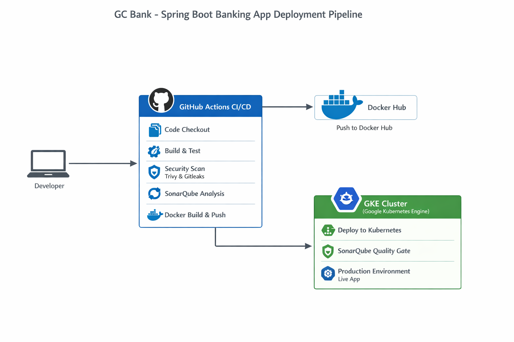

## GC Bank – Spring Boot Banking App

## Why I Built This

This project was built to simulate a real-world DevOps workflow for a production-ready Spring Boot application.

Instead of focusing only on writing backend code, I focused on:

- Reproducible environments using Docker
- Automated validation through CI/CD
- Security scanning before deployment
- Code quality enforcement using SonarQube Quality Gates
- Cloud-native deployment to GKE

The goal was to build a system where no code reaches production without passing automated quality, security, and build checks.

This repository contains a **Spring Boot 3 (Java 17) banking web application** with:
- **MySQL** as the database
- **Thymeleaf** UI
- **Spring Security** for authentication/authorization
- **Docker Compose** for local development
- A **GitHub Actions CI/CD pipeline** that runs on a self‑hosted runner:
  - Maven build and tests
  - Security scanning with **Trivy** (filesystem) and **Gitleaks**
  - Code quality and coverage analysis with **SonarQube**
  - Docker image build and push to Docker Hub
  - Deployment to a **GKE** Kubernetes cluster

---

## Tech Stack

- **Backend**: Spring Boot 3.3.3, Spring Web, Spring Data JPA, Spring Security, Thymeleaf
- **Language**: Java 17
- **Database**: MySQL 8
- **Build tool**: Maven
- **Testing**: JUnit (via `spring-boot-starter-test`), Spring Security Test
- **Code coverage**: JaCoCo
- **Static analysis**: SonarQube (`sonar.projectKey=GC-Bank`)
- **Containerization**: Docker, Docker Compose
- **CI/CD**: GitHub Actions (self‑hosted runner)
- **Deployment**: GKE (Google Kubernetes Engine) via `k8s.yml`

---

<p align="center">
  
</p>

## Project Structure (high level)

- `pom.xml` – Maven configuration and dependencies (Spring Boot, MySQL, JaCoCo, etc.)
- `docker-compose.yml` – Local MySQL + app containers
- `.github/workflows/maven.yml` – Full CI/CD pipeline
- `sonar-project.properties` – SonarQube project configuration
- `k8s.yml` – Kubernetes manifests for deployment (referenced in workflow)
- `src/` – Spring Boot application (controllers, services, entities, repositories, views, etc.)

---

## Prerequisites

- **Java 17+**
- **Maven 3.8+**
- **Docker** and **Docker Compose** (for containerized local run)
- Access to:
  - **SonarQube** server (for CI analysis)
  - **Docker Hub** account (for image push)
  - **GCP project + GKE cluster** (for deployment from CI)

---

## Running Locally (without Docker)

1. **Configure database**  
   - Ensure you have a running MySQL instance.  
   - Create a database, for example `bankappdb`.  
   - Set Spring datasource properties in `application.properties` / `application.yml` to point to your DB.

2. **Build the project**

   ```bash
   mvn clean package
   ```

3. **Run the application**

   ```bash
   mvn spring-boot:run
   ```

4. **Access the app**  
   - Default: `http://localhost:8080` (or the configured server port)

---

## Running Locally with Docker Compose

This repo includes a `docker-compose.yml` that starts:
- **MySQL** on host port `3307` (container `3306`) and initializes schema/data from `src/main/resources/static/mysql/SQLScript.txt`
- **bankapp** Spring Boot application on host port `8081`

1. **Build the app JAR (optional but recommended first run)**

   ```bash
   mvn clean package
   ```

2. **Start the stack**

   ```bash
   docker compose up --build
   ```

3. **Access the app**
   - Application: `http://localhost:8081`
   - MySQL (from host): `localhost:3307`

4. **Stop the stack**

   ```bash
   docker compose down
   ```

> **Note**: MySQL data is persisted using the `mysql_data` named volume.

---

## CI/CD Pipeline (GitHub Actions)

The workflow in `.github/workflows/maven.yml` runs on **push to `main`** and expects a **self-hosted runner**.

- **`compile` job**
  - Checks out code
  - Sets up JDK 17
  - Runs `mvn -B package`

- **`Security-check` job** (needs `compile`)
  - Installs **Trivy** and runs `trivy fs` against the repo (outputs `fs-report.json`)
  - Installs **Git** and **Gitleaks**
  - Runs `gitleaks detect` to scan for secrets (outputs `gitleaks-report.json`)

- **`test` job** (needs `Security-check`)
  - Runs `mvn test` with JDK 17

- **`build_project_and_sonar_scanner` job** (needs `test`)
  - Builds the project: `mvn package`
  - Uploads JAR from `target/*.jar` as artifact
  - Runs **SonarQube** scan and **Quality Gate** check using:
    - `SONAR_TOKEN` (GitHub secret)
    - `SONAR_HOST_URL` (GitHub Actions variable)

- **`docker_build_and_push` job** (needs `build_project_and_sonar_scanner`)
  - Logs in to Docker Hub using:
    - `DOCKERHUB_USERNAME` (GitHub Actions variable)
    - `DOCKERHUB_TOKEN` (GitHub secret)
  - Builds and pushes Docker image `rahul6364/bank-app:latest`

- **`deploy_to_k8s` job** (needs `docker_build_and_push`)
  - Authenticates to GCP using service account key (`GCP_SA_KEY` secret)
  - Sets GCP project (`GCP_PROJECT_ID` variable) and zone
  - Gets GKE credentials for cluster `bankapp-zonal` in `us-east1-b`
  - Ensures Kubernetes namespace `java` exists
  - Applies `k8s.yml` manifests into namespace `java`

---

## Required GitHub Secrets and Variables

Configure these in your **GitHub repository settings**:

- **Secrets**
  - `SONAR_TOKEN` – SonarQube authentication token
  - `DOCKERHUB_TOKEN` – Docker Hub access token/password
  - `GCP_SA_KEY` – GCP service account key JSON (base64 or raw JSON as used in the workflow)

- **Variables**
  - `SONAR_HOST_URL` – URL of the SonarQube server (e.g. `https://sonarqube.example.com`)
  - `DOCKERHUB_USERNAME` – Docker Hub username
  - `GCP_PROJECT_ID` – GCP project ID used for GKE

---

## SonarQube & Code Coverage

- Project key and name are defined in `sonar-project.properties`:
  - `sonar.projectKey=GC-Bank`
  - `sonar.projectName=GC-Bank`
- JaCoCo is configured in `pom.xml`:
  - `prepare-agent` goal attached before tests
  - `report` goal bound to the `test` phase
- CI workflow runs the SonarQube scan after tests and build, then checks the **Quality Gate**.

---

## Deployment Overview

The CI pipeline deploys to a **GKE** cluster:
- Uses `gcloud` CLI to authenticate and obtain cluster credentials.
- Creates/ensures the `java` namespace.
- Applies Kubernetes manifests from `k8s.yml`.  

To deploy manually from your local machine, you can replicate those steps:

```bash
gcloud auth activate-service-account --key-file=sa.json
gcloud config set project <GCP_PROJECT_ID>
gcloud config set compute/zone us-east1-b
gcloud container clusters get-credentials bankapp-zonal --zone us-east1-b
kubectl apply -f k8s.yml -n java
```

---

## License

This project is provided as-is for learning and demonstration purposes. Add an explicit license here if you plan to open source or distribute it.

